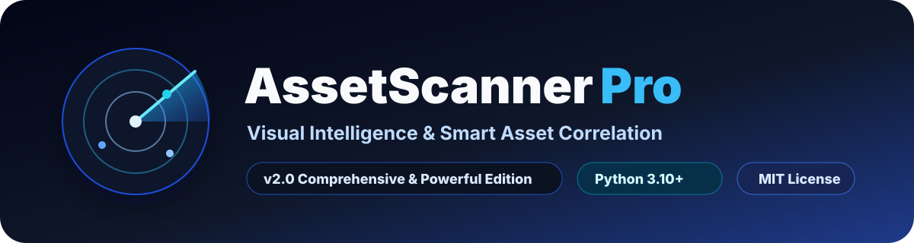
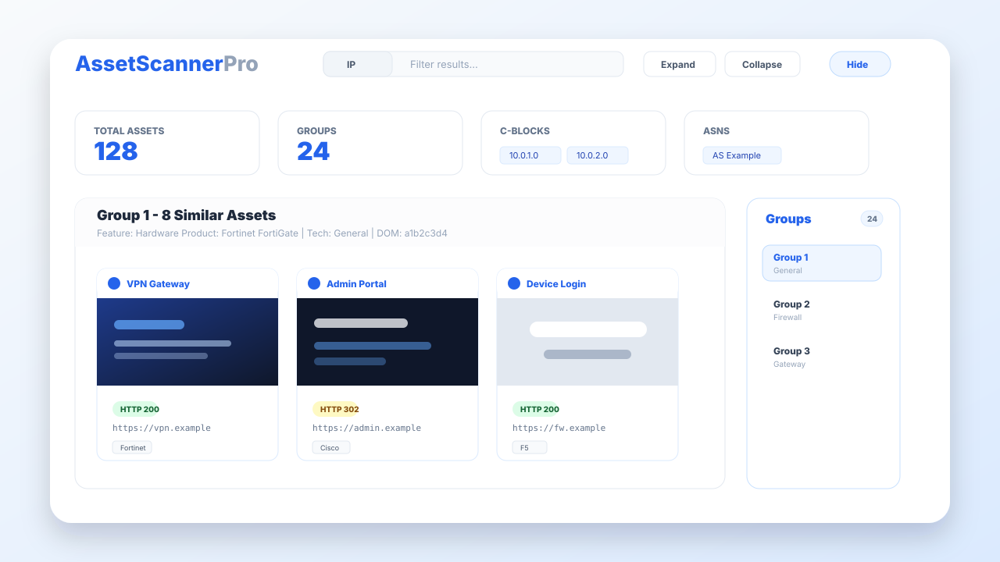

<p align="center">
  
</p>

<h1 align="center">AssetScanner Pro</h1>

<p align="center">
  <strong>Visual Intelligence &amp; Smart Asset Correlation for web-facing infrastructure.</strong>
</p>

<p align="center">
  <a href="LICENSE"></a>
  
  
  
</p>

<p align="center">
  <a href="#features">Features</a> |
  <a href="#installation">Installation</a> |
  <a href="#quick-start">Quick Start</a> |
  <a href="#command-reference">Command Reference</a> |
  <a href="#security-and-privacy">Security</a>
</p>

---

AssetScanner Pro is a Python-based web asset scanner that renders targets with a real headless browser, captures screenshots and favicons, fingerprints web and infrastructure products, groups visually or structurally similar assets, and generates an interactive HTML report for review.

It is designed for authorized asset inventory, exposure review, visual triage, and correlation of duplicated or related web-facing systems.

> Attribution: [BimBox](https://github.com/BimBoxH4/AssetScanner-Pro)



## Project Details

| Item | Details |
| --- | --- |
| Application | AssetScanner Pro |
| Version | `v2.0 Comprehensive & Powerful Edition` |
| Tagline | Visual Intelligence & Smart Asset Correlation |
| Main script | `assetScanner-pro.py` |
| Runtime | Python 3.10+ recommended |
| Browser | Google Chrome or Chromium, driven by Selenium |
| Report format | Standalone interactive HTML with companion assets directory |
| License | MIT |

## Features

- Scan one URL, one host, or a file containing many targets.
- Render JavaScript-heavy pages with Selenium and headless Chrome.
- Capture compressed screenshots and favicons into a report-specific assets directory.
- Extract titles, H1 text, final URLs, paths, HTTP status, media type, IPs, network blocks, ASN, organization, CDN hints, DOM hashes, visible text hashes, favicon hashes, and screenshot hashes.
- Detect technologies with Wappalyzer when enabled.
- Fingerprint exposed infrastructure products including Fortinet, Citrix ADC, F5 BIG-IP, Cisco, Palo Alto, SonicWall, Sophos, Check Point, Juniper, MikroTik, Ubiquiti, pfSense, OpenWrt, VMware, Proxmox, iDRAC, iLO, Synology, QNAP, Hikvision, Dahua, Huawei, H3C, ZTE, Sangfor, Ruijie, Aruba, TP-Link, D-Link, and Netgear.
- Download and cache external product fingerprint rules from FingerprintHub by default.
- Group similar assets using weighted DOM, text, visual, title, H1, favicon, technology, path, and product evidence.
- Generate a standalone interactive HTML report with grouped sections, filters, status badges, sidebar navigation, lazy-loaded screenshots, and lightbox previews.
- Serve a generated report through a temporary password-protected Flask web interface.
- Use `--fast` for low-resource systems or large scans.
- Enrich IPs with Shodan open-port intelligence through `--shodan-key` or `SHODAN_API_KEY`.

## Requirements

- Python 3.10 or newer is recommended.
- Google Chrome or Chromium must be installed and available to Selenium.
- Internet access is recommended for first-run ChromeDriver installation, fingerprint updates, Wappalyzer metadata, geo lookups, and optional Shodan enrichment.
- CPU and memory capacity should match browser concurrency. Use `-t 1` or `-t 2` on constrained servers.

## Installation

Install Python 3.10 or newer, then install Chrome or Chromium. `webdriver-manager` downloads a matching ChromeDriver automatically, but Chrome/Chromium itself must already be installed.

### Install Chrome Or Chromium

| OS | Chrome / Chromium installation |
| --- | --- |
| Windows | `winget install Google.Chrome` or `winget install Chromium.Chromium` |
| macOS | `brew install --cask google-chrome` or `brew install --cask chromium` |
| Ubuntu / Debian | `sudo apt update && sudo apt install -y chromium-browser` |
| Kali Linux | `sudo apt update && sudo apt install -y chromium` |
| Fedora / RHEL | `sudo dnf install -y chromium` |
| Arch Linux | `sudo pacman -Syu chromium` |

For Debian-based systems where Chromium is unavailable, install Google Chrome directly:

```bash
wget https://dl.google.com/linux/direct/google-chrome-stable_current_amd64.deb
sudo apt install -y ./google-chrome-stable_current_amd64.deb
```

For Fedora/RHEL systems where Chrome is preferred:

```bash
wget https://dl.google.com/linux/direct/google-chrome-stable_current_x86_64.rpm
sudo dnf install -y ./google-chrome-stable_current_x86_64.rpm
```

### Install AssetScanner Pro

#### Windows PowerShell

```powershell
git clone https://github.com/BimBoxH4/AssetScanner-Pro.git
cd AssetScanner-Pro
py -3 -m venv .venv
.\.venv\Scripts\Activate.ps1
python -m pip install --upgrade pip
python -m pip install -r requirements.txt
```

If PowerShell blocks activation, run this once for the current user and retry activation:

```powershell
Set-ExecutionPolicy -Scope CurrentUser RemoteSigned
```

#### Windows CMD

```bat
git clone https://github.com/BimBoxH4/AssetScanner-Pro.git
cd AssetScanner-Pro
python -m venv .venv
.venv\Scripts\activate.bat
python -m pip install --upgrade pip
python -m pip install -r requirements.txt
```

#### Ubuntu / Debian / Kali

```bash
sudo apt update
sudo apt install -y python3 python3-venv python3-pip git
git clone https://github.com/BimBoxH4/AssetScanner-Pro.git
cd AssetScanner-Pro
python3 -m venv .venv
source .venv/bin/activate
python -m pip install --upgrade pip
python -m pip install -r requirements.txt
```

#### Fedora / RHEL

```bash
sudo dnf install -y python3 python3-pip git
git clone https://github.com/BimBoxH4/AssetScanner-Pro.git
cd AssetScanner-Pro
python3 -m venv .venv
source .venv/bin/activate
python -m pip install --upgrade pip
python -m pip install -r requirements.txt
```

#### Arch Linux

```bash
sudo pacman -Syu python python-pip git
git clone https://github.com/BimBoxH4/AssetScanner-Pro.git
cd AssetScanner-Pro
python -m venv .venv
source .venv/bin/activate
python -m pip install --upgrade pip
python -m pip install -r requirements.txt
```

#### macOS

```bash
brew install python git
git clone https://github.com/BimBoxH4/AssetScanner-Pro.git
cd AssetScanner-Pro
python3 -m venv .venv
source .venv/bin/activate
python -m pip install --upgrade pip
python -m pip install -r requirements.txt
```

### Verify Installation

```bash
python assetScanner-pro.py --version
python assetScanner-pro.py -u https://example.com -r test-report.html
```

## Quick Start

Scan one target and write `scanner_report.html`:

```bash
python assetScanner-pro.py -u https://example.com
```

Scan many targets from a file:

```bash
python assetScanner-pro.py -f targets.txt -r report.html
```

Use low-resource mode:

```bash
python assetScanner-pro.py -f targets.txt --fast -t 1 --timeout 20 --render-wait 0.2 --retries 1
```

Serve an existing report locally:

```bash
python assetScanner-pro.py --server 127.0.0.1:8080 -r report.html
```

The report server prints a temporary password at startup.

## Target Input

Targets can be supplied as a single value or as a text file with one URL or host per line.

```text
https://example.com
http://192.0.2.10:8080
assets.example.org
```

If a target does not include a scheme, AssetScanner Pro tries HTTP and HTTPS candidates.

## Command Reference

### Target Input

| Option | Description |
| --- | --- |
| `-u`, `--url URL` | Scan one target URL or host. The scheme is optional. |
| `-f`, `--file FILE` | Read target URLs or hosts from a text file, one per line. |

### Output And Serving

| Option | Default | Description |
| --- | --- | --- |
| `-r`, `--report FILE` | `scanner_report.html` | Output HTML report path. Screenshots and icons are saved beside it in a matching assets directory. |
| `--server IP:PORT` | | Serve the report directory through a password-protected web UI. IPv6 bracket syntax is supported, for example `[::1]:8080`. |

### Performance And Browser Tuning

| Option | Default | Description |
| --- | --- | --- |
| `-t`, `--threads N` | `4` | Number of concurrent browser workers. Use fewer workers on low-resource systems. |
| `--timeout SEC` | `45` | Maximum page-load time per target. |
| `--render-wait SEC` | `0.6` | Extra wait after page readiness before screenshot capture. |
| `--retries N` | `2` | Retry count per target after navigation or capture failure. |
| `--fast` | disabled | Skip technology, geo, and HTTP preflight enrichment and block extra browser noise. |
| `--proxy URL` | | Proxy for browser and HTTP requests, for example `http://127.0.0.1:8080`. |

### Fingerprinting And Enrichment

| Option | Default | Description |
| --- | --- | --- |
| `-s`, `--similarity 0-10` | `5` | Visual similarity threshold used when grouping screenshots. |
| `--no-tech` | disabled | Skip Wappalyzer technology detection. |
| `--no-geo` | disabled | Skip DNS geo, ASN, and CDN enrichment. |
| `--no-http-check` | disabled | Skip preflight HTTP status and content-type request. |
| `--shodan-key KEY` | | Shodan API key for enriching each IP with known open ports. |
| `--no-shodan` | disabled | Disable Shodan port enrichment even when a key is available. |
| `--fingerprints FILE` | `asset_fingerprints.json` | Local JSON product fingerprint cache path. |
| `--fingerprints-url URL` | built-in FingerprintHub URLs | Custom remote JSON fingerprint database URL. |
| `--no-auto-fingerprints` | disabled | Disable automatic online fingerprint refresh. |
| `--update-fingerprints` | disabled | Download and update the local fingerprint database. Can be combined with scanning. |
| `--check-fingerprints-update` | disabled | Check whether the remote fingerprint database changed. |

### Diagnostics

| Option | Description |
| --- | --- |
| `--verbose` | Show non-fatal navigation and fingerprint warnings. |
| `--version` | Print version information. |

## Report Output

For a report path such as `report.html`, the scanner writes:

- `report.html`: the interactive HTML report.
- `report_assets/`: screenshots and favicon images referenced by the report.
- `asset_fingerprints.json`: the default local fingerprint cache when automatic refresh or manual update is used.

Keep the HTML report and its assets directory together when moving or publishing results.

## Fingerprint Updates

Update the default local fingerprint cache:

```bash
python assetScanner-pro.py --update-fingerprints
```

Check for an available update without replacing the local cache:

```bash
python assetScanner-pro.py --check-fingerprints-update
```

Use a custom fingerprint source:

```bash
python assetScanner-pro.py --fingerprints-url https://example.com/fingerprints.json --update-fingerprints
```

## Shodan Enrichment

Pass a key directly:

```bash
python assetScanner-pro.py -f targets.txt --shodan-key YOUR_KEY
```

Or set an environment variable on Windows:

```bash
set SHODAN_API_KEY=YOUR_KEY
python assetScanner-pro.py -f targets.txt
```

On Linux or macOS:

```bash
export SHODAN_API_KEY=YOUR_KEY
python assetScanner-pro.py -f targets.txt
```

## Operational Notes

- Use only on assets you own or are explicitly authorized to assess.
- Start with a low thread count when scanning unfamiliar infrastructure.
- Use `--fast` for unstable systems, constrained VPS instances, or very large target files.
- Use `--no-auto-fingerprints` in offline environments.
- Press `Ctrl+C` during scanning to choose whether to save a partial report.
- The report server generates a random password each run and is intended for temporary local or controlled-network access.

## Troubleshooting

| Symptom | Likely Cause | Fix |
| --- | --- | --- |
| `Missing required dependency` | Python package is not installed in the active environment. | Run `python -m pip install -r requirements.txt`. |
| Browser fails to start | Chrome or Chromium is missing, blocked, or incompatible. | Install or update Chrome/Chromium and retry. |
| ChromeDriver download fails | Network or proxy issue. | Retry with internet access or configure network/proxy policy. |
| Many targets fail with timeouts | Targets are slow, blocked, or browser concurrency is too high. | Increase `--timeout`, lower `-t`, or use `--fast`. |
| Technology detection is slow | Wappalyzer enrichment adds overhead. | Use `--no-tech` or `--fast`. |
| Geo/ASN fields show skipped values | `--fast` or `--no-geo` is enabled. | Remove those flags if enrichment is required. |

## Security And Privacy

AssetScanner Pro stores screenshots, favicons, titles, IPs, technologies, URLs, and other target metadata in the generated report and assets directory. Treat reports as sensitive assessment artifacts and avoid committing real scan results to public repositories.

This tool is intended for legitimate security work on systems you own or have permission to test. Do not use it for unauthorized scanning.

## License

This project is released under the MIT License. See [LICENSE](LICENSE).
